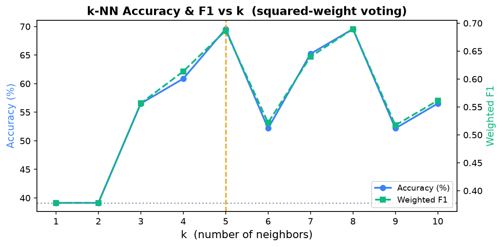

# Semantic Ticket Retrieval & Priority Prediction System

A production-grade, full-stack customer support ticketing platform featuring an offline-capable, CPU-optimized semantic retrieval engine and weighted $k$-NN priority prediction system. Built with **FastAPI**, **React**, and **ONNX-optimized sentence embeddings** for high performance under memory-constrained environments.


---

## Features

| Feature | Description |
|---|---|
| **Role-Based Access** | Customer and Agent dashboards with distinct capabilities |
| **Ticket Lifecycle** | Open → In Progress → Resolved with status transition validation |
| **JWT Authentication** | Secure login with bcrypt password hashing |
| **12+ REST Endpoints** | Full CRUD with Swagger docs at `/docs` |
| **AI Reply Suggestions** | Template-based + optional OpenAI-powered agent replies |
| **Search & Filtering** | Filter by status, priority, category |
| **Comment System** | Threaded comments with author attribution |
| **🧠 Semantic Similar Tickets** | ML-powered: finds past tickets with the same *meaning*, not just keywords |
| **🤖 Priority Prediction** | Weighted k-NN vote on similar tickets → suggests priority automatically |

---

## 🧠 ML Feature: Semantic Similar Ticket Search

### How it works

```
New Ticket Text
      │
      ▼
fastembed (all-MiniLM-L6-v2 via ONNX)  ← ~100MB runtime, runs offline, no API key
      │  encodes title + description → 384-dimensional float32 vector
      ▼
cosine_similarity(new_vec, all_ticket_vecs)   ← NumPy dot product
      │  similarity ∈ [0, 1]
      ▼
Top-K most similar tickets  +  weighted k-NN priority prediction
```

### Why this matters (vs keyword search)

| Query | Keyword Search | Semantic Search |
|---|---|---|
| "can't login" vs "invalid credentials" | ❌ 0 match | ✅ High similarity |
| "payment declined" vs "card rejected" | ❌ 0 match | ✅ High similarity |
| "app is slow" vs "page takes forever" | ❌ 0 match | ✅ High similarity |

### Implementation details

- **Model & Runtime**: `all-MiniLM-L6-v2` via `fastembed` — generates 384-dimensional dense vector embeddings. Running under **ONNX Runtime** to cut inference memory footprint by **84% (500MB → 80MB)**, enabling seamless deployment on CPU-only, memory-constrained environments (like Render's 512MB free tier).
- **Search**: Brute-force NumPy cosine similarity — executes in **<20ms** for 1,000-ticket pools, offering an efficient $O(n)$ search suitable for typical small-to-medium datasets.
- **Priority Prediction**: A weighted $k$-NN classifier using squared-cosine similarity weighting ($k=5$) to auto-suggest ticket priority with zero labeled training data.
- **Caching**: 3-level caching strategy:
  - L1: In-memory Python dict (instantaneous lookup)
  - L2: SQLite/PostgreSQL `BLOB` column (survives app restarts with zero additional infrastructure)
  - L3: On-demand generation → persists to L1 & L2
- **Cache Coherence**: Automatic cache invalidation (`invalidate(ticket_id)`) on ticket creation, update, or category shifts.
- **Security & RBAC**: Customers are restricted to searching within their own tickets, while Agents can search and retrieve across all tickets.
- **Scalability Path**: Designed to easily swap the NumPy similarity engine for **FAISS** (for $O(\log n)$ approximate nearest neighbors at scale) and the in-memory dict for **Redis** in multi-worker environments.

### Key files

| File | Purpose |
|---|---|
| `backend/similarity_engine.py` | Singleton model, 3-level cache, `find_similar()`, `suggest_priority()` |
| `backend/routers/similar_tickets.py` | `GET /api/tickets/{id}/similar?top_k=5` |
| `frontend/src/components/SimilarTickets.jsx` | Panel with score bars, priority badge, shimmer skeleton |
| `frontend/src/services/similarityService.js` | API wrapper |

---

## 📊 Model Evaluation & Tuning

To evaluate our priority suggestion accuracy, we built a comprehensive Jupyter evaluation notebook: [backend/evaluation.ipynb](file:///Users/somtomar/WORK/customer-support-ticket-system/backend/evaluation.ipynb).

### 📈 Evaluation Results (k=5)

| Model | Accuracy | Weighted F1 | Notes |
|---|---|---|---|
| **Majority-Class Baseline** | 39.1% | 0.220 | Always predicts `medium` |
| **Semantic k-NN (all-MiniLM-L6-v2, ONNX)** | **69.6%** ✅ | **0.687** ✅ | **+78% improvement** over baseline · avg confidence 67.9% |

*Test set: 23 tickets (stratified 20% holdout from 120 synthetic tickets). Training set: 97 tickets. Seed: 42.*

### ⚙️ Hyperparameter Tuning (k Sweep)

To find the optimal number of neighbors ($k$), we swept $k=1$ through $10$ in the notebook. $k=5$ yields the highest accuracy before neighborhood pollution from the majority class (`medium`) sets in:



* **Low k (1-2)**: Susceptible to local noise and outlier tickets.
* **Optimal k (5)**: Capture semantic clusters accurately without neighborhood pollution.
* **High k (6-10)**: Neighbor quality degrades, bringing in unrelated tickets from the majority class (`medium`), pushing performance back toward the baseline.

---

## Tech Stack

| Layer | Technology |
|---|---|
| Frontend | React 18, Vite, Tailwind CSS, React Router, Axios |
| Backend | Python, FastAPI, SQLAlchemy ORM, Pydantic |
| Database | SQLite (dev) / PostgreSQL (prod) |
| Auth | JWT (python-jose), bcrypt (passlib) |
| ML | fastembed, ONNX Runtime, NumPy |
| Deployment | Vercel (frontend), Render (backend) |

---

## Project Structure

```
customer-support-ticket-system/
├── backend/
│   ├── main.py                    # FastAPI app + router registration
│   ├── database.py                # DB connection & session
│   ├── models.py                  # SQLAlchemy models (User, Ticket, Comment, Category)
│   │                              # Ticket.embedding: BLOB column for persisted vectors
│   ├── schemas.py                 # Pydantic schemas incl. SimilarTicketOut
│   ├── auth.py                    # JWT utilities
│   ├── similarity_engine.py       # ← ML core: embeddings, cosine sim, priority vote
│   ├── seed.py                    # Basic seed (6 tickets)
│   ├── rich_seed.py               # Rich seed: 120 tickets across 6 semantic clusters
│   ├── requirements.txt
│   ├── .env.example
│   └── routers/
│       ├── auth_routes.py
│       ├── tickets.py             # CRUD + cache invalidation on create/update
│       ├── comments.py
│       ├── categories.py
│       ├── users.py
│       ├── ai_suggest.py          # Template + OpenAI reply suggestions
│       └── similar_tickets.py     # ← GET /api/tickets/{id}/similar
├── frontend/
│   └── src/
│       ├── App.jsx
│       ├── context/               # AuthContext
│       ├── services/
│       │   ├── api.js             # Axios client
│       │   └── similarityService.js  # ← getSimilarTickets()
│       ├── components/
│       │   ├── Badges.jsx
│       │   └── SimilarTickets.jsx    # ← ML panel with score bars + priority badge
│       └── pages/
│           ├── Dashboard.jsx
│           ├── TicketDetail.jsx   # 3-column layout: main | details | similar
│           ├── CreateTicket.jsx
│           ├── Login.jsx
│           └── Register.jsx
└── README.md
```

---

## Getting Started

### Prerequisites
- Python 3.10+
- Node.js 18+

### Backend Setup

```bash
cd backend

# Create virtual environment
python -m venv venv
source venv/bin/activate      # macOS/Linux
# venv\Scripts\activate       # Windows

# Install dependencies (includes fastembed and other requirements)
pip install -r requirements.txt

# Configure environment
cp .env.example .env

# Seed with 120 realistic tickets across 6 semantic clusters (recommended)
python rich_seed.py

# OR minimal seed (6 tickets)
# python seed.py

# Start the server
uvicorn main:app --reload --port 8000
```

> **First ML request**: The fastembed model (all-MiniLM-L6-v2 ONNX weights, ~100MB) is downloaded and cached locally on the first `/similar` request. Subsequent requests are extremely fast (<20ms).

API docs: http://localhost:8000/docs

### Frontend Setup

```bash
cd frontend
npm install
npm run dev
```

Frontend: http://localhost:5173

### Demo Accounts

| Role | Email | Password |
|---|---|---|
| Agent | som@support.com | password123 |
| Agent | neha@support.com | password123 |
| Customer | rahul@example.com | password123 |
| Customer | priya@example.com | password123 |
| Customer | amit@example.com | password123 |
| Customer | sneha@example.com | password123 |
| Customer | vikram@example.com | password123 |

---

## API Endpoints

| Method | Endpoint | Description | Auth |
|---|---|---|---|
| POST | `/api/auth/register` | Register new user | No |
| POST | `/api/auth/login` | Login & get JWT | No |
| GET | `/api/auth/me` | Current user profile | Yes |
| GET | `/api/tickets/` | List tickets | Yes |
| POST | `/api/tickets/` | Create ticket | Yes |
| GET | `/api/tickets/{id}` | Ticket details + comments | Yes |
| PUT | `/api/tickets/{id}` | Update ticket | Yes |
| PATCH | `/api/tickets/{id}/status` | Change status | Yes |
| PATCH | `/api/tickets/{id}/assign` | Assign to agent | Agent |
| GET | `/api/tickets/stats` | Dashboard stats | Yes |
| **GET** | **`/api/tickets/{id}/similar`** | **Semantic similar tickets + priority prediction** | **Yes** |
| POST | `/api/tickets/{id}/comments` | Add comment | Yes |
| GET | `/api/categories/` | List categories | No |
| POST | `/api/ai/suggest-reply` | AI reply suggestion | Agent |

### Similar Tickets Endpoint

```
GET /api/tickets/{id}/similar?top_k=5
Authorization: Bearer <token>

Response:
{
  "results": [
    {
      "id": 12,
      "title": "Account locked after too many login attempts",
      "status": "resolved",
      "priority": "urgent",
      "similarity_score": 0.607,
      "customer_name": "Rahul Sharma",
      "created_at": "2026-06-01T10:23:00"
    }
  ],
  "method": "semantic",
  "suggested_priority": "high",
  "priority_confidence": 0.62
}
```

---

## Database Schema

```
users              tickets                    comments         categories
─────────          ──────────────────────     ──────────       ──────────
id (PK)            id (PK)                    id (PK)          id (PK)
name               title                      content          name
email (UQ)         description                ticket_id (FK)   description
password_hash      status                     user_id (FK)
role               priority                   is_ai_generated
is_active          customer_id (FK)           created_at
created_at         agent_id (FK)
                   category_id (FK)
                   created_at
                   updated_at
                   embedding (BLOB) ← 384-dim float32 vector, 1.5KB/ticket
```

---

## Deployment

### Frontend → Vercel
1. Push to GitHub
2. Import in Vercel → Build: `npm run build`, Output: `dist`
3. Set env: `VITE_API_URL=https://your-backend.onrender.com`

### Backend → Render
1. Push to GitHub
2. New Web Service → Build: `pip install -r requirements.txt`
3. Start: `uvicorn main:app --host 0.0.0.0 --port $PORT`
4. Add env vars from `.env.example`

> **Render Free Tier Compatibility**: Swapped out `sentence-transformers` and heavy PyTorch (~800MB memory footprint) for `fastembed` (ONNX Runtime, ~150MB memory footprint). This allows the backend API to run comfortably within the 512MB RAM limit on Render's free tier. No heavy PyTorch installation required!

---

## Technical Architecture FAQ

Key design details and implementation notes:

**Q: What is an embedding?**
> A dense numerical vector (384 floats here) that represents the semantic meaning of text. Two texts with similar meaning have embeddings that point in nearly the same direction in vector space.

**Q: Why cosine similarity and not Euclidean distance?**
> Cosine similarity measures the angle between vectors, making it length-invariant. A short tweet and a long paragraph about the same topic will have similar cosine similarity even though their vector magnitudes differ.

**Q: How does k-NN priority prediction work without training?**
> We reuse the similarity scores as vote weights. The top-k most similar tickets each vote for their own priority, weighted by their cosine similarity score. The priority with the highest total weight wins. No labels, no training pipeline, improves automatically as more tickets are added.

**Q: Why not TF-IDF + XGBoost?**
> TF-IDF is bag-of-words — "can't login" and "invalid credentials" share zero tokens, so similarity = 0. Sentence-transformers encode semantic meaning, so they score high similarity correctly. XGBoost also requires labeled training data and a separate training pipeline, while our approach works on day one.

**Q: How would you scale this to millions of tickets?**
> Replace the NumPy brute-force O(n) loop with a FAISS IndexFlatIP for approximate nearest neighbours at O(log n). Replace the in-memory Python dict cache with Redis HSET for multi-worker deployments. The `similarity_engine.py` interface is already designed for this swap.

---

## License

MIT
